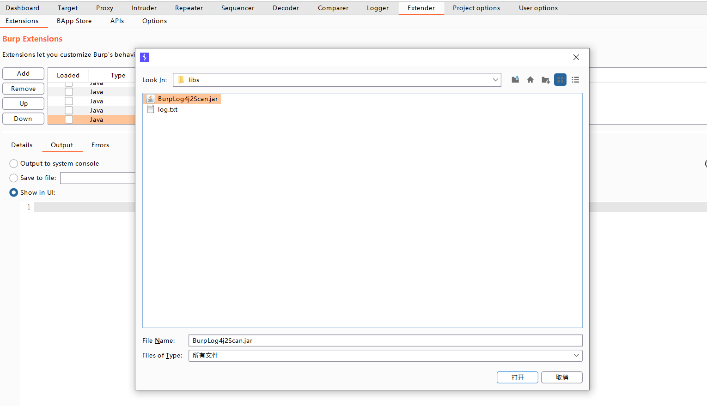
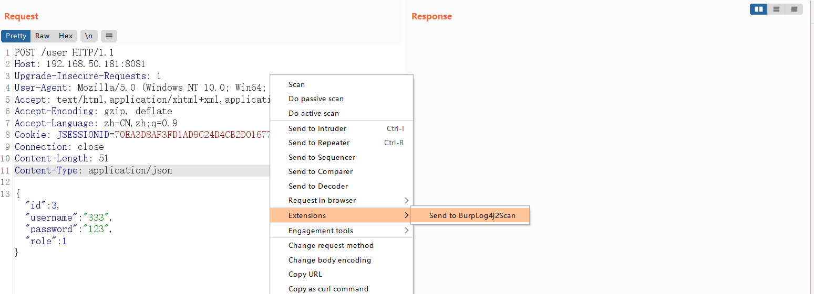
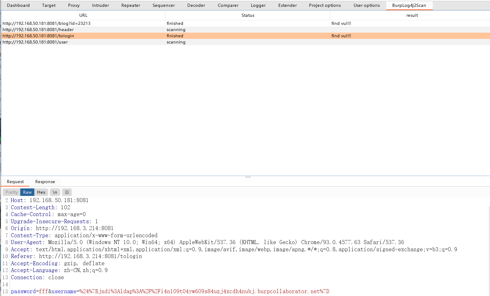
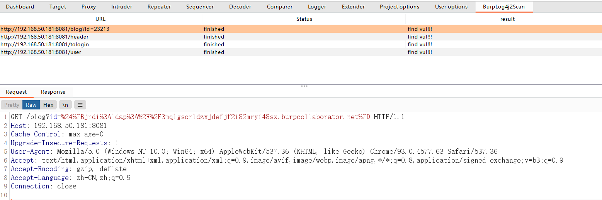
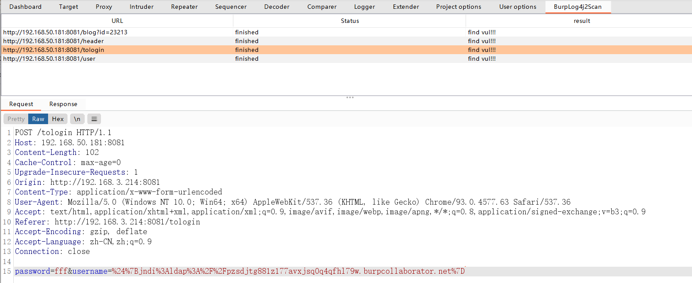
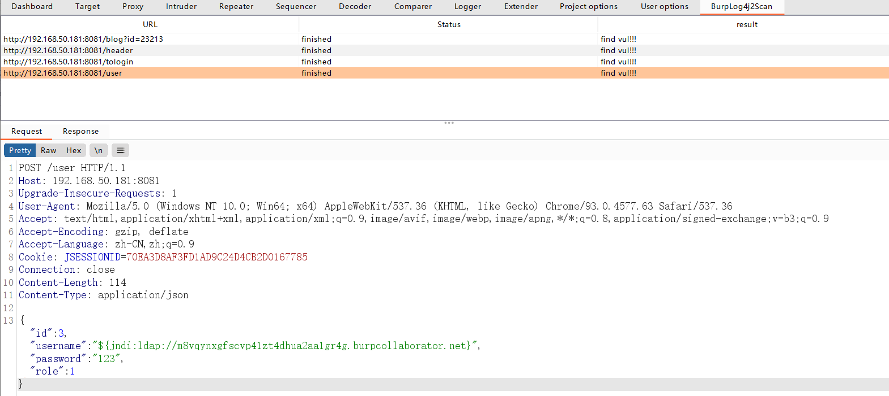

# burpplugin_log4jScanner (basing on tangxiaofeng7)

### How to use
1. Load BurpLog4j2Scan.jar through Extender

2. Right click the request which you want to check and then follow Extensions >Send to BurpLog4j2Scan

3. Be patient and wait for the result, or maybe you can grab a coffee. The scan time could be around 10 minutes for complicated request.
4. Find the result in BurpLog4j2Scan Tab. If vuln exists, you can check the injected request and then further investigate on it.

### What it supports:
1. Get parameter check:

2. Post parameter check:

3. Json parameter check:

4. Header check(First check original header, and then add some guess headers for further check )

### Features:
1. Cover checking on get,post,json,header
2. Add some bypass waf payloads
3. Accurate detection, and can investigate the detail clearly after vuln has been found.
